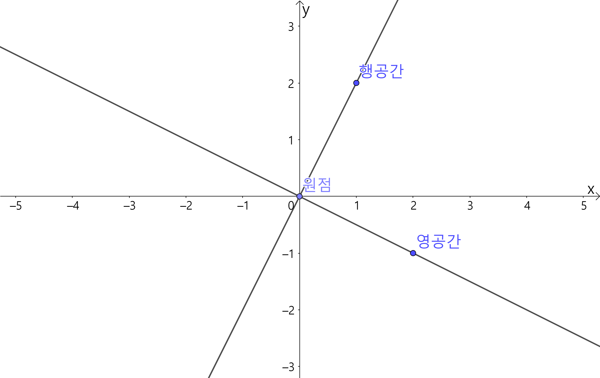
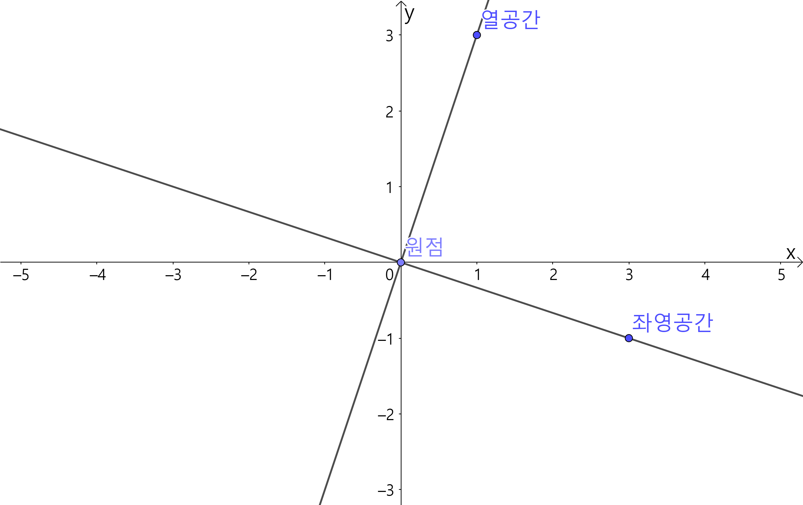

여러 수학에는 기본정리라고 불리는 여러 중요한 정리들이 있다.

대표적인 기본정리로는 미적분학 기본정리(fundamental theorem of calculus), 대수학의 기본정리(fundamental theorem of algebra)등이 있다.

그렇다면 **선형대수학의 기본정리**라고 부를 수 있는 중요한 정리는 무엇이 있을까?

# Introduction
## 1.3 The Four Fundamental Subspaces

이 절에서는 Starng 교수님이 계속 강조하는 선형대수학의 $4$가지 부분공간에 대해서 다루고 있다. 

1. **column space** $\mathbf{C}(A)$
$A$의 열의 모든 일차 결합
2. **row space** $\mathbf{C}(A^T)$
$A^T$의 열의 모든 일차 결합
3. **nullspace** $\mathbf{N}(A)$
$A\mathbf{x}=0$의 모든 해 $\mathbf{x}$
4. **left nullspace** $\mathbf{N}(A^T)$
$A^T\mathbf{y}=0$의 모든 해 $\mathbf{y}$

간단한 Example을 통해서 이 부분공간들의 concept과 이 공간들이 왜 중요한지에 대해서 이해해보자.

### Example  
$$A=\begin{bmatrix}1&2\\3&6\end{bmatrix}=\mathbf{uv}^T$$

모든 부분공간들은 $\mathbb{R}^2$의 부분공간이다.
1. $\mathbf{C}(A)$는 원점과 $\mathbf{u}=\begin{bmatrix}1\\3\end{bmatrix}$을 지나는 직선
2. $\mathbf{C}(A^T)$는 원점과 $\mathbf{u}=\begin{bmatrix}1\\2\end{bmatrix}$을 지나는 직선
3. $\mathbf{N}(A)$는 원점과 $\mathbf{u}=\begin{bmatrix}2\\-1\end{bmatrix}$을 지나는 직선
4. $\mathbf{N}(A^T)$는 원점과 $\mathbf{u}=\begin{bmatrix}3\\-1\end{bmatrix}$을 지나는 직선

|  | |
|:--:|:--:|
|  |  |
